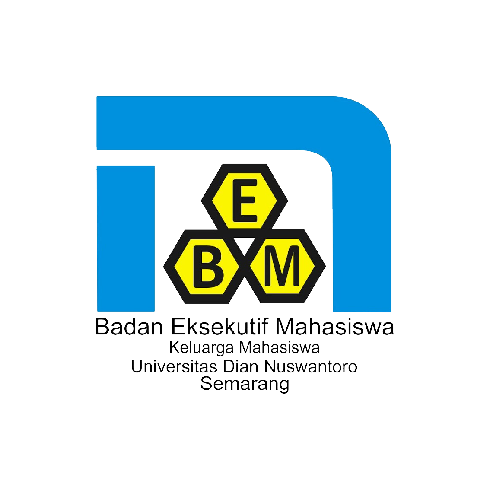

# 🌐 Website Resmi BEM KM UDINUS



Website **Portal BEM KM UDINUS** adalah platform resmi yang berfungsi sebagai pusat informasi, publikasi, dan komunikasi Badan Eksekutif Mahasiswa Keluarga Mahasiswa Universitas Dian Nuswantoro (BEM KM UDINUS).  
Website ini dirancang untuk meningkatkan transparansi, memperkuat citra kelembagaan, serta memudahkan mahasiswa dan publik dalam mengakses seluruh kegiatan dan informasi BEM KM.

---

## 🎯 **Tujuan**

Portal ini dibangun sebagai wadah digital untuk:

-   Menyediakan informasi kegiatan dan program kerja BEM KM secara terbuka.
-   Menjalin komunikasi antara BEM KM dan mahasiswa UDINUS.
-   Menjadi pusat dokumentasi publikasi resmi BEM KM.
-   Mendukung sistem administrasi digital kelembagaan BEM KM.

---

## ⚙️ **Fitur Utama**

### 🔐 1. Autentikasi

Admin dapat melakukan login menggunakan **akun Google Orma BEM KM UDINUS** untuk mengakses **Dashboard Admin**, yang digunakan dalam mengelola seluruh konten website.

---

### 💬 2. Sambutan Presma

Menampilkan **foto**, **nama**, serta **kalimat sambutan** dari Presiden Mahasiswa (Presma) periode berjalan sebagai bentuk representasi dan pengenalan kepemimpinan kabinet.

---

### 🎯 3. Visi dan Misi

Berisi **nama kabinet**, **visi**, dan **misi** resmi dari kepengurusan **BEM KM UDINUS Periode 2025/2026**, untuk memberikan arah dan nilai perjuangan organisasi.

---

### 🏛️ 4. Struktur Kabinet

Menampilkan **struktur organisasi BEM KM**, yang meliputi:

-   Nama **Divisi/Kementerian**
-   **Logo Divisi/Kementerian**
-   **Ketua/Menteri** dan **daftar anggota** di dalamnya

Fitur ini membantu pengunjung mengenal susunan kepengurusan dan tanggung jawab masing-masing bagian.

---

### 📅 5. Kegiatan

Memuat daftar **program kerja** dan **duta kampus** dari BEM KM UDINUS.  
Setiap kegiatan dapat menampilkan detail acara serta **formulir pendaftaran peserta** bila kegiatan bersifat terbuka untuk umum atau mahasiswa.

---

### 📰 6. Postingan

Berisi kumpulan **berita**, **informasi**, **artikel kajian**, dan **berita acara kegiatan** hasil pelaksanaan program kerja BEM KM.  
Fitur ini menjadi media publikasi dan dokumentasi digital resmi.

---

### 🤝 7. Partnership

Memberikan informasi mengenai **SOP Kerjasama** antara pihak luar dengan BEM KM, mencakup:

-   Media Partner
-   Sponsorship
-   Kolaborasi Mitra
-   Kampus Visit
-   Delegasi atau kegiatan eksternal lainnya

---

### 📞 8. Kontak

Berisi informasi lengkap untuk menghubungi BEM KM UDINUS, antara lain:

-   📧 **Email**
-   📱 **Nomor Telepon**
-   📸 **Instagram**
-   🌐 **Website Resmi**
-   📘 **Facebook**
-   🎵 **TikTok**
-   ▶️ **YouTube**

---

## 🛠️ Teknologi yang Digunakan

-   **Framework:** Laravel 11
-   **Frontend:** Tailwind CSS
-   **Database:** MySQL
-   **Environment:** Laragon (Local Development)
-   **Version Control:** Git & GitHub

---

## 📋 Persyaratan Sistem

-   PHP >= 8.2
-   Composer
-   Node.js & NPM >= 20.19.x
-   MySQL Server
-   Web Server (Laravel Herd, Laragon, XAMPP, atau Valet)

---

## ⚡ Instalasi & Setup Project

### 1️⃣ Clone Repository

```bash
git clone https://github.com/adka-fawaid/PortalBEMKMUDINUS.git
cd PortalBEMKMUDINUS
```

### 2️⃣ Install Dependencies

```bash
# Install PHP dependencies
composer install

# Install Node.js dependencies
npm install
```

### 3️⃣ Environment Setup

```bash
# Copy environment file
cp .env.example .env

# Generate application key
php artisan key:generate
```

### 4️⃣ Database Setup

```bash
# Run migrations
php artisan migrate

# Seed database with sample data
php artisan db:seed
```

### 5️⃣ Storage Link

```bash
# Create storage link for file uploads
php artisan storage:link
```

### 6️⃣ Build Assets

```bash
# Development
npm run dev

# Production
npm run build
```

### 7️⃣ Run Application

```bash
# Start development server
php artisan serve
```

---

## 👥 **Dikembangkan Oleh**

Kementerian Kreativitas dan Inovasi BEM KM UDINUS  
_Kreasi JosJis_  
**BEMKM UDINUS 2025/2026**

---

## 📜 Lisensi

© 2025/2026 BEM KM Universitas Dian Nuswantoro.  
Seluruh hak cipta dilindungi.
